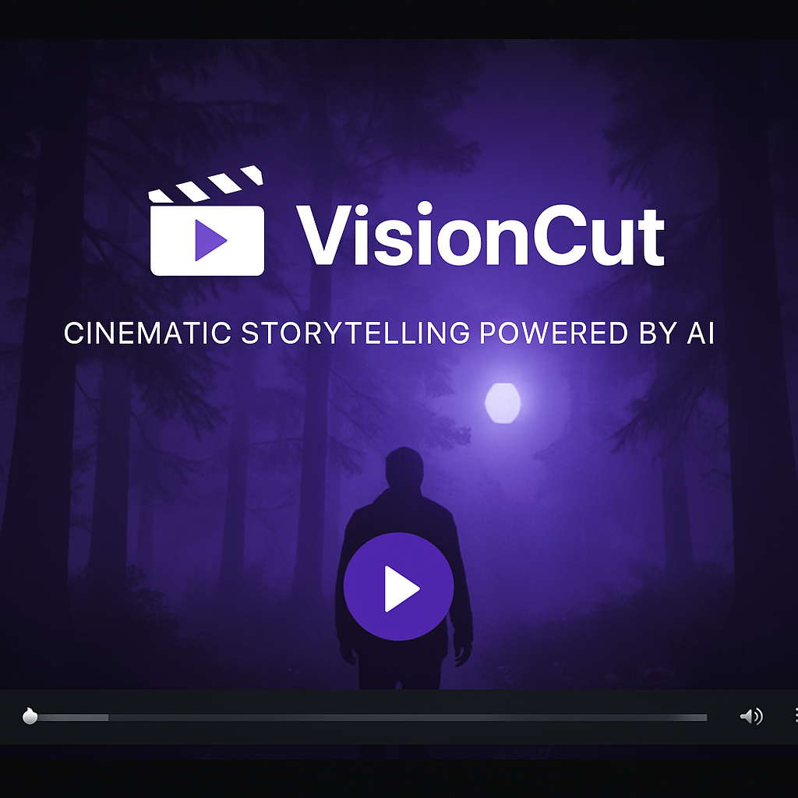
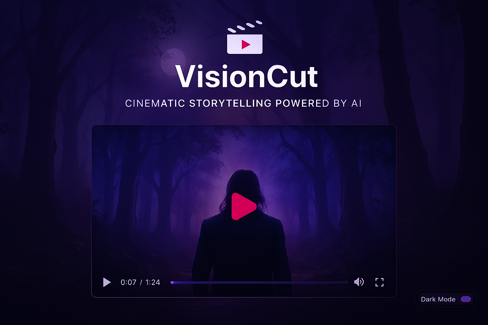
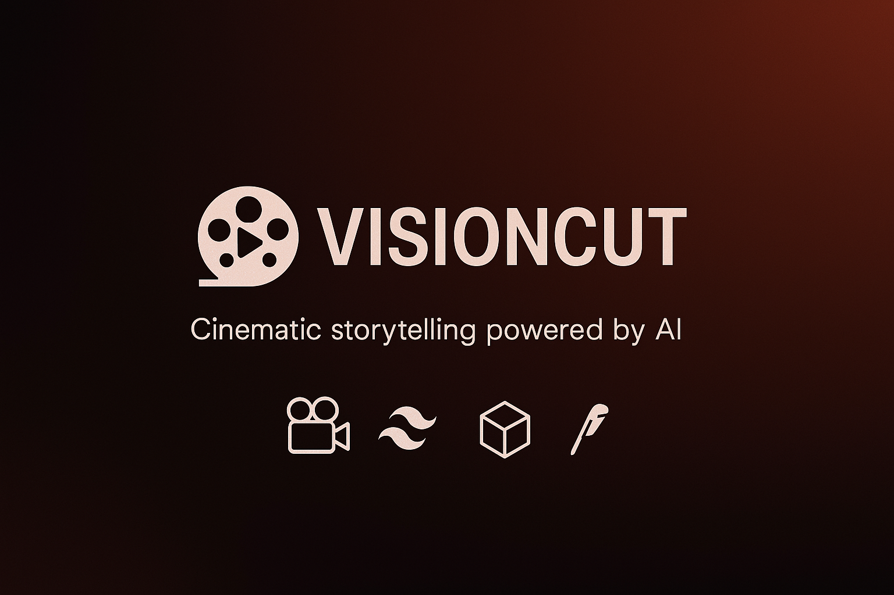

<p align="center">
  
</p>

<h1 align="center">🎞️ VisionCut</h1>

<p align="center">
  <strong>Cinematic storytelling powered by AI</strong><br/>
  React • Tailwind CSS • Lucide Icons • Yoco Payments
</p>

<p align="center">
  <a href="https://visioncut.netlify.app" target="_blank">
    
  </a>
  <a href="https://github.com/YOUR_USERNAME/visioncut/blob/main/LICENSE">
    
  </a>
</p>

---

## 🎬 Features

- Cinematic genre gallery with hover effects
- AI-powered scene preview with intro video
- Mood filters and genre-themed palettes
- Manual dark mode toggle 🔄
- Yoco card payments (Starter & Pro packs)
- Responsive layout with animated transitions
- Custom animations for credits, blur, zoom, glow

---

## 🖼️ Screenshots

> Drop these into `public/screenshots/`

### 🎥 Welcome Intro  


### 🎭 Genre Gallery  


### 💳 Payment Modal  


---

## 🚀 Getting Started

```bash
# Install dependencies
npm install

# Start the app
npm run dev
